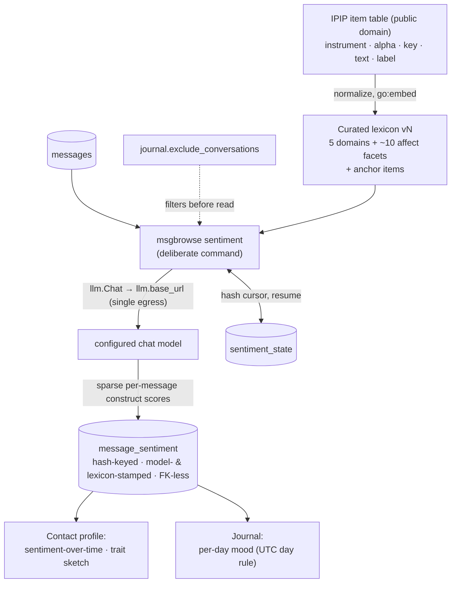

# ADR-0027: IPIP-anchored sentiment & trait scoring — the `message_sentiment` table

- **Status:** Proposed
- **Date:** 2026-07-29
- **Deciders:** Joe Stump
- **Extends:** [ADR-0011 (contact facts)](0011-contact-facts-extraction.md) —
  the incremental, cited, model-stamped LLM extraction pattern this feature is
  modeled on: hash cursor, idempotent writes, bounded concurrency, exclude list,
  single egress.
- **Related:**
  - [ADR-0023 (AI-editorialized journal)](0023-ai-editorialized-journal.md) —
    per-day mood is a deferred consumer of this table; the journal established
    the UTC day-bucketing rule any mood rollup must reuse.
  - [ADR-0010 (security/privacy posture)](0010-security-privacy-posture.md) —
    single egress to `llm.base_url`, `journal.exclude_conversations`, and the
    "deliberate step, never a side effect" rule all bind here.
  - [ADR-0002 (vector backend)](0002-vector-backend.md) — the FK-less,
    hash-keyed derived-cache precedent that survives re-ingest, and the "no new
    services" posture that rules out a separate NLP stack.
  - [SPEC-0017 REQ-0017-010](../openspec/specs/contact-profile/spec.md) — the
    contact profile explicitly deferred sentiment-over-time, per-day mood, and
    their siblings to "a hash-keyed, model-stamped NLP table (e.g.
    `message_sentiment`)". This ADR fills that reserved slot.

## Context and Problem Statement

The contact profile ([SPEC-0017](../openspec/specs/contact-profile/spec.md))
and the journal ([ADR-0023](0023-ai-editorialized-journal.md)) both deferred
their affect-shaped surfaces — sentiment-over-time, per-day mood — to a future
per-message NLP table. Before building that table, one question decides most of
its shape: **what labeling scheme do the scores use?**

A naive answer is a single valence score (positive/negative/neutral). It is
cheap, but it is also shallow — "positive" flattens gratitude, excitement,
relief, and sarcasm into one bit — and it is unanchored: two prompt wordings, or
two models, produce incompatible score distributions, and there is no reference
point to calibrate against.

The [International Personality Item Pool](https://ipip.ori.org) (IPIP) offers a
better foundation. It is an explicitly **public-domain** scientific
collaboratory ("one can copy, edit, translate, or use them for any purpose
without asking permission and without paying a fee") of 3,000+ personality
items and 250+ validated scales. Its consolidated **item-assignment table**
(`TedoneItemAssignmentTable30APR21.xlsx`, from
[ipip.ori.org](https://ipip.ori.org/newMultipleconstructs.htm)) maps 3,805 item
assignments — 1,961 unique self-report statements like *"Am easily
discouraged"* or *"Act wild and crazy"* — onto **246 named constructs** across
36 instruments (NEO, HEXACO, BFAS, 16PF, VIA, …), each assignment carrying a
keying direction (+1/−1) and the source scale's reliability (alpha).

Those items are exactly the artifact an LLM judge lacks today: short, concrete,
behaviorally-anchored exemplars of what each construct *looks like in ordinary
language*. The decision is whether to adopt IPIP's constructs as msgbrowse's
sentiment/trait taxonomy, which subset to score, and how the table and pipeline
around it should work.

## Decision

Adopt IPIP as the labeling scheme for message-level affect and trait scoring,
implemented as a `msgbrowse sentiment` command writing a hash-keyed,
model-stamped `message_sentiment` table, modeled directly on `facts`
([ADR-0011](0011-contact-facts-extraction.md)).

### 1. A curated two-tier construct set, not all 246 labels

The full 246-label taxonomy is far too wide to score per message — most labels
(Leadership, Aesthetic Appreciation, Machiavellianism…) are noise for a message
archive, and a 246-way rubric would swamp any prompt. The scoring set is a
**curated lexicon** with two tiers:

- **Trait tier — the Big Five domains** (5 constructs): Extraversion,
  Agreeableness, Conscientiousness, Neuroticism, and Intellect/Openness, keyed
  to the corresponding labels in the item table. These feed long-window
  personality sketches ("how does this person come across in messages?").
- **Affect tier — mood-adjacent facets** (~10 constructs, default set): Anger,
  Anxiety, Depression, Cheerfulness, Hope/Optimism, Calmness, Vulnerability,
  Self-consciousness, Vitality/Enthusiasm/Zest, Empathy — all present as labels
  in the item table. These are what "sentiment-over-time" and "per-day mood"
  actually aggregate; they carry the emotional signal a single valence number
  flattens.

The exact membership is pinned by the spec, and the set is **versioned**: the
lexicon file carries a `lexicon_version`, and changing the curation re-derives
scores the same way a model change does (§4).

### 2. IPIP items are prompt anchors, not questionnaires

msgbrowse never administers an inventory. For each construct in the lexicon,
its marker items — preferring assignments from high-alpha instruments, with
their +/− keying — are compiled into the scoring prompt as behavioral anchors:
*"Anxiety (high: 'Am afraid that I will do the wrong thing', 'Am easily hurt';
low: 'Am relaxed most of the time')"*. The model scores the degree to which a
message batch *expresses* each construct, returning sparse per-message scores.

This framing is a load-bearing honesty constraint: outputs are **estimates of
what a person's messages express**, not measurements of what a person *is*.
Every surface built on this table inherits the AI-generated labeling
([ADR-0011](0011-contact-facts-extraction.md)) plus an "expressed in messages,
not a psychological assessment" disclaimer.

### 3. Storage: sparse, hash-keyed, FK-less, model- and lexicon-stamped

A new schema migration adds:

```
message_sentiment(
  message_hash TEXT NOT NULL,      -- content hash, survives re-ingest rowid churn
  model        TEXT NOT NULL,      -- chat model that produced the score
  lexicon_version TEXT NOT NULL,   -- curated construct-set version
  construct    TEXT NOT NULL,      -- IPIP label, e.g. 'Anxiety'
  score        REAL NOT NULL,      -- signed −1.0..+1.0 on the construct's axis
  ts_unix      INTEGER NOT NULL,   -- denormalized for time-bucketed aggregation
  contact_id   INTEGER,            -- denormalized contact scope at scoring time
  UNIQUE(message_hash, model, lexicon_version, construct)
)
```

- **Sparse:** only constructs with salient evidence are stored. Most messages
  ("ok", "see you at 6") score nothing and cost no rows.
- **Signed:** the Big Five domains are bipolar (reserved ↔ gregarious), so the
  sign carries direction on the axis and the magnitude carries strength of
  expression; affect facets use the positive range in practice.
- **FK-less:** no foreign key to `messages` — a CASCADE would wipe scores on
  every re-ingest, the identical reasoning as `embeddings` ([ADR-0002](0002-vector-backend.md))
  and `contact_facts` ([ADR-0011](0011-contact-facts-extraction.md)). Writes
  are `INSERT … ON CONFLICT DO NOTHING`-style idempotent upserts.

### 4. Incremental orchestration, mirroring `facts`

`msgbrowse sentiment` is a deliberate command — never a side effect of import
or serving ([ADR-0010](0010-security-privacy-posture.md)). A
`sentiment_state(conversation_id, last_message_hash, model, lexicon_version)`
cursor records progress per conversation; the hash resolves back to a
`(ts_unix, id)` keyset position so re-ingest cannot strand it; a missing hash
restarts from the top (safe — writes are idempotent). A different stored
`model` **or** `lexicon_version` rescans from the start. Batches run under a
small worker pool with the cursor persisted per batch, so a mid-run failure
resumes where it stopped. `journal.exclude_conversations` filters threads by
name before any content is read, and the only network call is `llm.Chat` to
`llm.base_url`.

### 5. The IPIP item table ships in-repo, public domain

The Tedone spreadsheet is normalized once into a committed, `go:embed`-ed data
file (columns preserved: `instrument, alpha, key, text, label`) with an
attribution header crediting IPIP and the Oregon Research Institute. Shipping
it is unambiguous — IPIP is public domain by design. The curated lexicon (§1)
is a second, small committed file that selects constructs and anchor items from
the full table; anchor selection (which items, how many, alpha threshold) is a
build-time concern of the lexicon, not a runtime query over 3,805 rows.

### 6. Aggregation surfaces are read-side consumers, out of scope here

Sentiment-over-time and a trait sketch on the contact profile, and per-day mood
in the journal, become plain SQL aggregates over `message_sentiment` (affect
facets bucketed by month or by UTC day per [ADR-0023](0023-ai-editorialized-journal.md)'s
day rule; domains averaged over long windows). None of them change SPEC-0017's
contact-scope predicate — exactly the plug-in seam REQ-0017-010 reserved. Their
requirements land in the follow-up spec, not this ADR.

## Considered Options

### Labeling scheme

- **IPIP construct taxonomy (chosen)** — public-domain, psychometrically
  grounded labels with 1,961 ready-made behavioral anchor items and keying
  directions. Prompts calibrate against fixed anchors instead of prompt-author
  vibes, so scores are more stable across prompt edits and model swaps.
- **Plain valence sentiment** (positive/negative/neutral or −1..1) — cheapest
  and simplest, but flattens the signal into one dimension, gives the contact
  profile nothing trait-shaped, and has no anchor set; every prompt tweak
  silently shifts the distribution.
- **Free-form LLM emotion tags** — let the model emit whatever labels it likes.
  Zero curation cost, but the label space drifts per model and per run, making
  aggregation (the entire point of the table) unreliable without a taxonomy to
  coerce into anyway.
- **Classical local lexicon (VADER/NRC-style)** — no egress at all, which is
  attractive under [ADR-0010](0010-security-privacy-posture.md). But
  word-count lexicons perform poorly on short, sarcastic, emoji-laden chat
  text, provide no trait dimension, and would add a second NLP stack alongside
  the one configured LLM — against the no-new-services posture of
  [ADR-0002](0002-vector-backend.md)/[ADR-0004](0004-mcp-sdk-and-rag.md).

### Construct set

- **Big Five domains + curated affect facets, ~15 constructs (chosen)** — the
  affect tier serves every deferred surface (mood, sentiment-over-time); the
  domain tier adds the personality sketch nearly for free; the rubric stays
  small enough to prompt well.
- **Affect facets only** — cheapest per batch, but discards the personality
  half of IPIP, which is the reason to adopt IPIP over a mood word-list.
- **Full NEO 30-facet set (+ domains)** — richer profiles, but ~3× the scoring
  surface for facets (Cautiousness, Artistic Interests…) with no planned UI
  consumer, and a 35-way rubric measurably degrades per-construct quality.
- **All 246 labels** — false precision; most labels are irrelevant to a message
  archive, and no prompt can hold a 246-way rubric.

### Scoring granularity

- **Per-message sparse scores (chosen)** — matches the reserved
  `message_sentiment(message_hash, …)` design, survives re-ingest by content
  hash, and lets every future surface choose its own bucketing (day, month,
  contact, conversation) at read time.
- **Per-day or per-window scores only** — fewer rows and fewer LLM calls, but
  bakes one aggregation into the write path; a new surface needing a different
  window forces a full re-score. Windowing belongs on the read side.
- **Per-conversation rollups** — cheapest, but cannot answer "how did this
  month feel?" or drive any time-series tile at all.

## Consequences

### Positive

- Fills SPEC-0017's reserved slot with the exact provenance/idempotency
  contract it named: hash-keyed, model-stamped, FK-less, re-ingest-safe.
- One table feeds every deferred surface — sentiment-over-time, per-day mood,
  and a trait sketch — as read-side aggregates; no schema change per surface.
- Anchored prompts: scoring is calibrated against fixed public-domain items,
  not ad-hoc prompt prose, so model/prompt changes are re-derivable
  (`lexicon_version` + `model` stamps) rather than silently incompatible.
- No new services, no new egress: one `llm.Chat` endpoint, exclude list
  honored, deliberate command — the posture of ADR-0010/0011 unchanged.
- The shipped item table is public domain; no licensing risk in-repo.

### Negative

- **Inferring traits about other people from their messages is ethically
  sensitive.** Mitigations are structural, not optional: local-only storage,
  excluded threads never scored, every surface labeled AI-generated with an
  "expressed in messages, not an assessment" framing, and scores never leave
  the machine — but the feature still builds a personality-shaped dossier of
  contacts, and the spec must treat that as a first-class privacy concern
  (e.g. per-contact opt-out alongside the conversation exclude list).
- Scores are **not psychometrically valid measurements** — IPIP validation
  applies to self-report questionnaires, not LLM judgments of third-party
  text. The anchors improve consistency, not validity.
- Corpus-scale LLM cost: scoring an archive is the most expensive extraction
  yet (every message batch, ~15 constructs). Incremental cursors and sparse
  output bound it, but a full first run on a large archive is slow and, on
  paid endpoints, costs real money.
- IPIP items are English; scoring quality degrades on non-English threads and
  the lexicon has no translated anchors.

### Neutral

- `lexicon_version` means curation changes (adding a facet) trigger rescans —
  the same cost/benefit trade already accepted for `model` changes in facts.
- Keying direction and alpha ship in the embedded table but are consumed only
  at lexicon build time (anchor selection), not at runtime.
- The contact profile and journal specs gain new requirements later; nothing
  in this ADR changes their current rendered output.

## Architecture Diagram



## Requirements

Pinned by a follow-up spec (`/sdd:spec sentiment`): the exact lexicon
membership and anchor-selection rules, the scoring prompt contract and score
semantics, the migration, cursor and rescan behavior, per-contact opt-out, and
the WHEN/THEN scenarios for each consumer surface.

## More Information

- IPIP: https://ipip.ori.org — public-domain statement on the home page;
  multi-construct inventories at https://ipip.ori.org/newMultipleconstructs.htm
- Source data: `TedoneItemAssignmentTable30APR21.xlsx` (3,805 assignments,
  1,961 unique items, 246 labels, 36 instruments; keys +1/−1, scale alphas).
- [ADR-0011](0011-contact-facts-extraction.md) — the extraction pattern this
  mirrors; [ADR-0023](0023-ai-editorialized-journal.md) — day bucketing;
  [ADR-0010](0010-security-privacy-posture.md) — egress and exclusion;
  [ADR-0002](0002-vector-backend.md) — FK-less derived caches.
- [SPEC-0017 REQ-0017-010](../openspec/specs/contact-profile/spec.md) — the
  deferral this ADR resolves.
