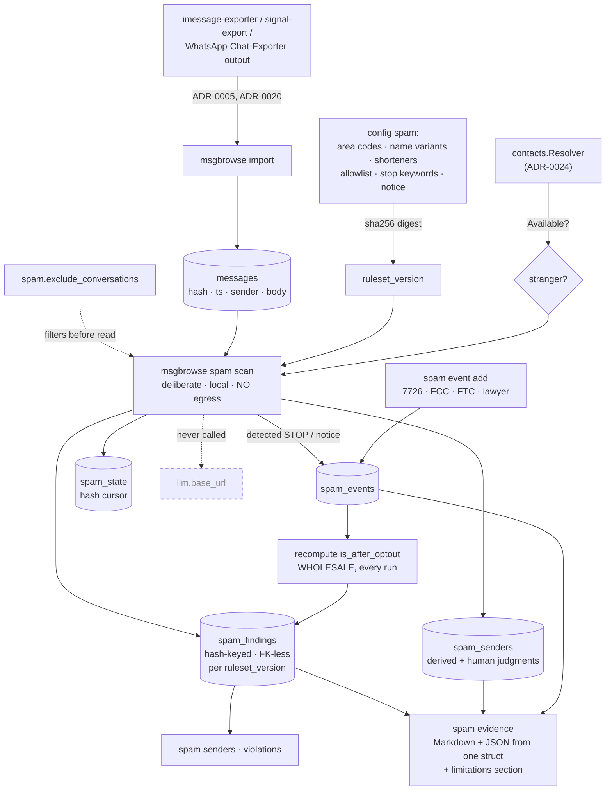

# ADR-0029: Unsolicited-contact evidence — the `spam_findings` layer

- **Status:** Proposed
- **Date:** 2026-08-22
- **Deciders:** Joe Stump, Jon Stump
- **Extends:**
  - [ADR-0011](0011-contact-facts-extraction.md) — the incremental,
    hash-cursored, generation-stamped derivation pattern this feature reuses
    wholesale: per-conversation cursor, idempotent writes, exclude list,
    deliberate command.
  - [ADR-0024](0024-contact-merging-and-address-book-abstraction.md) — the
    `contacts.Resolver` seam is how "is this person a stranger?" is answered,
    and the reason that question has a tri-state answer rather than a boolean.
- **Related:**
  - [ADR-0002](0002-vector-backend.md) — the FK-less, hash-keyed derived-cache
    precedent that survives a re-ingest, and the no-new-services posture.
  - [ADR-0010](0010-security-privacy-posture.md) — single egress to
    `llm.base_url`; this ADR adds a feature with **zero** egress and explicitly
    declines to add a second one.
  - [ADR-0028](0028-ipip-sentiment-trait-scoring.md) — the most recent sibling
    derivation; the shape of `spam_findings` is modeled on `message_sentiment`.
  - [ADR-0005](0005-imessage-txt-parser.md) — the text-export format whose
    fidelity limits bound what this record can honestly claim.
- **Upstream:** [jonstump/spam-catcher](https://gitea.stump.rocks/jonstump/spam-catcher)
  — a standalone Python tool that reads a copy of macOS `chat.db` and produces
  the same artifact. This ADR is the decision to bring its *analysis* layer into
  msgbrowse rather than run it alongside.

## Context and Problem Statement

[spam-catcher](https://gitea.stump.rocks/jonstump/spam-catcher) is a read-only
evidence logger for unsolicited SMS and iMessage: it copies `chat.db`, records
the strangers who messaged you and what they said, classifies each message
against a small ruleset, detects the opt-outs you sent, computes how many
contacts fell inside any twelve-month window, and exports a per-sender dossier
for a TCPA / Do Not Call complaint.

Almost everything it does, msgbrowse already does better or already has the
pieces for. msgbrowse holds the whole archive in SQLite with FTS5 and a stable
content hash per message; it has a pluggable address book
([ADR-0024](0024-contact-merging-and-address-book-abstraction.md)) to answer
"is this a stranger?"; it has three battle-tested derived-cache layers
(`embeddings`, `contact_facts`, `message_sentiment`) with exactly the
incrementality and idempotency contract an evidence log needs; and it has a
web UI, an MCP server, and a desktop shell that a standalone Python script
never will.

What spam-catcher has that msgbrowse does not is **the domain model**: the
classification ruleset, the opt-out semantics, the rolling twelve-month window
math, the sender status ladder, the consent field, and the dossier format.
Those are the interesting part, and they are portable.

Two problems have to be decided before porting:

1. **Where does the data come from?** spam-catcher's central safety property is
   that it never opens the live `chat.db` — it copies it, hashes the copy,
   `chmod 444`s it, reads it read-only, and deletes it. msgbrowse never touches
   `chat.db` at all; it reads **exporter output**
   ([ADR-0005](0005-imessage-txt-parser.md),
   [ADR-0020](0020-bundled-exporters-guided-setup.md)). That is a *safer*
   posture, but it costs fidelity, and some of what it costs is evidentiary.
2. **Does msgbrowse grow a second network egress?** spam-catcher calls a
   carrier-lookup API to establish line type (mobile / landline / VoIP), which
   is a substantive TCPA element because autodialer restrictions apply
   differently to wireless numbers. msgbrowse's entire privacy story is one
   configurable egress.

## Decision

Port spam-catcher's analysis layer into msgbrowse as **`internal/spam` plus a
`spam_findings` derived-cache layer and a `msgbrowse spam` command tree**, using
the archive msgbrowse already holds. Do **not** port its `chat.db` acquisition
layer, and do **not** add carrier lookup.

### 1. It is a derivation over the existing archive, not a second ingest

`msgbrowse spam scan` reads `messages` and writes four tables. It never reads
`chat.db`, never runs an exporter, and never writes to the archive. Every safety
property spam-catcher engineered around the live database is satisfied by not
having the problem: msgbrowse's relationship with the source of truth is
mediated by the exporter, which is [ADR-0020](0020-bundled-exporters-guided-setup.md)'s
job, not this feature's.

The corollary is that **chain of custody now belongs to the exporter run**, not
to this layer. `ingest_runs` records the import; `spam_findings` records what
was concluded from it; the per-message `body_sha256` in a dossier proves the
text has not changed since msgbrowse imported it. None of that proves anything
about the fidelity of the export itself, and §6 makes the record say so.

### 2. Storage: hash-keyed, FK-less, ruleset-stamped — with one non-derived table

A schema migration (v18) adds:

```
spam_findings(message_hash, ruleset_version, source, identifier, direction,
              ts_unix, reasons, urls, phones, emails, names_matched, entities,
              is_candidate, is_after_optout,
              UNIQUE(message_hash, ruleset_version))
spam_senders(source, identifier, conversation_name, status, suspected_entity,
             consent_status, consent_notes, notes, first_seen_unix,
             last_seen_unix, …, UNIQUE(source, identifier))
spam_events(source, identifier, event_type, event_at, event_at_unix, details,
            origin, message_hash, UNIQUE(source, identifier, event_type,
            event_at_unix, message_hash))
spam_state(conversation_id, last_message_hash, ruleset_version, updated_at)
```

- **No foreign key to `messages`**, for the identical reason as `embeddings`
  ([ADR-0002](0002-vector-backend.md)), `contact_facts`
  ([ADR-0011](0011-contact-facts-extraction.md)), and `message_sentiment`
  ([ADR-0028](0028-ipip-sentiment-trait-scoring.md)): re-ingest deletes and
  re-inserts message rows with new rowids and identical content hashes, so a
  CASCADE would wipe the evidence record on every import.
- **`ruleset_version` is the generation stamp**, playing the role `model` plays
  for facts and `(model, lexicon_version)` plays for sentiment. It is a digest
  of the effective `spam:` config. Widening the watch list rescans everything,
  because a dossier that mixed two rule generations would silently mean two
  different things by "candidate".
- **`spam_findings` is not sparse.** Unlike `message_sentiment`, a message from
  a stranger that trips nothing still gets a row. The rolling-window counts are
  counts of *contact*, not counts of violation, and "we examined this message
  and it tripped nothing" is itself part of the record.
- **`spam_senders` is the one table that is not purely derived.** `status`,
  `suspected_entity`, `consent_status`, `consent_notes` and `notes` are human
  judgments. A scan may promote `seen` → `watch`; it may never overwrite
  anything a person set, and `--reset` must not take them.

### 3. Zero egress, and no carrier lookup in v1

Classification is deterministic, local, and regex/keyword based — no LLM. This
makes `spam` the first msgbrowse derivation with **no network egress at all**,
which matters: an archive a user is unwilling to send to an LLM can still be
scanned.

Carrier and line-type lookup is **declined for v1**. It would be msgbrowse's
second egress and its first to an unrelated third party, for a feature the rest
of the product does not need — and spam-catcher's own README states its provider
endpoints are unverified. A follow-up slice may add it as an explicitly opt-in
`spam.lookup` block with its own table; until then the dossier renders
"not established" rather than a blank, and names the gap in its limitations
section (§6).

### 4. "Stranger" is answered by the address book, with an honest degraded mode

spam-catcher's rule was: if Contacts cannot be read, treat everyone as a
stranger and warn. That is correct for a tool that only ever stores
non-contacts. It is wrong here — msgbrowse already holds the whole archive, so
the same rule would enroll every friend and relative as a spam sender.

The predicate is therefore, in order: not one of `spam.my_numbers`; not on
`spam.allowlist`; and then

- **address book Available** — a sender the resolver knows is not a stranger.
  This is the accurate path, and it needs the `macoscontacts` build tag or the
  desktop app.
- **address book Absent / NeedsPermission** — **degraded mode**: only threads
  whose name is a bare phone number or email address are examined, on the
  reasoning that an exporter names a thread after the person when it can resolve
  one. This is a heuristic and it fails in both directions, so the run summary
  says so loudly and the CLI prints a warning. It does not fail open.

### 5. Opt-out state is recomputed wholesale, never incrementally

`is_after_optout` is rewritten across the entire generation after every scan and
after every manually recorded opt-out, because an opt-out entered today changes
the flag on messages scanned months ago. An incremental update would leave the
column quietly wrong on exactly the rows a filing depends on. The threshold is
the sender's **earliest** opt-out; a later STOP does not reset the clock. Only
inbound messages are ever flagged.

Two counts are reported and they are not the same number: the trailing twelve
months (what a form asks for) and **the largest count in any twelve-month
window** (what the DNC private right of action turns on).

### 6. The dossier states what it cannot establish, in the artifact

Every export carries a fixed limitations section, and the first entry is the
consequential one:

> Timestamps are the archive's local wall-clock time with **no recorded UTC
> offset** — the exporter does not preserve one.

"Exact timestamp with timezone" is an explicit evidentiary requirement, and
msgbrowse cannot meet it from a text export
([ADR-0005](0005-imessage-txt-parser.md): the format is
`May 20, 2020 9:10:11 AM`, parsed as naive wall clock). Neither Apple's message
GUID nor its ROWID survives the export, so a message here cannot be pointed back
at a row in a fresh `chat.db`.

Putting that in the artifact rather than only in the docs is a decision, not a
formality. A dossier that silently implies a precision the pipeline does not
have is the one failure mode worth engineering against, because the person
relying on it is doing so in a filing.

### 7. Read surfaces are CLI-first

v1 ships `spam scan | senders | violations | evidence | sender-set | event`.
A web surface and MCP tools are deliberately out of scope for the first slice
and land in a follow-up spec — a dossier is a legal-adjacent artifact and its
presentation deserves its own design pass, not a table bolted onto the contacts
page.

## Considered Options

### Where the feature lives

- **A derivation inside msgbrowse (chosen).** One archive, one contacts model,
  one address book, one backup story. The classification, opt-out and
  window logic is ~600 lines of pure Go over rows msgbrowse already has; the
  incremental machinery is already written three times over.
- **Keep spam-catcher standalone.** Zero integration risk, and it keeps direct
  `chat.db` fidelity — the timestamps, GUIDs and SMS/iMessage distinction
  msgbrowse loses. But it duplicates ingest, contacts, and storage; it only ever
  sees iMessage (Signal and WhatsApp spam are invisible to it); and every
  msgbrowse surface — search, the journal, the desktop app — stays unaware the
  evidence exists.
- **Standalone tool that writes into msgbrowse's database.** Worst of both: two
  writers to one SQLite file, two migration lineages, and the immutable-migration
  guarantee ([`scripts/check-migrations.sh`](../../scripts/check-migrations.sh))
  broken by construction.
- **A msgbrowse plugin/extension seam.** There is no plugin architecture, and
  inventing one for a single consumer is a much larger decision than this
  feature warrants.

### Where the messages come from

- **The imported archive (chosen).** No new access to the live database, no new
  TCC surface, no working-copy lifecycle to get wrong, and it generalizes to
  every source msgbrowse imports rather than only iMessage.
- **Read `chat.db` directly, as spam-catcher does.** Recovers UTC offsets,
  GUIDs, ROWIDs, and the SMS/iMessage distinction — real evidentiary value. But
  it means a second ingest path, macOS-only, a Full Disk Access requirement, and
  a copy-hash-chmod-delete lifecycle whose failure modes include corrupting the
  user's iCloud sync. That is a much bigger decision than this feature, and if
  msgbrowse ever wants it, it belongs in an ADR about *ingestion fidelity*, not
  one about spam.
- **Extend the iMessage exporter to emit offsets.** The cleanest long-term fix
  for the timestamp gap, but it is upstream work in a third-party tool and
  cannot gate this feature.

### Classification engine

- **Deterministic rules (chosen).** Reproducible, auditable, explainable in a
  filing ("this message tripped `area_code:555` and `shortener:bit.ly`"), free,
  and zero egress. An evidence record whose conclusions cannot be re-derived
  is not much of an evidence record.
- **LLM classification.** Would catch spam no keyword list does. But it makes
  the finding unreproducible, sends the entire corpus to an endpoint, and puts
  a model's judgment in a document headed for a lawyer.
- **Hybrid: rules now, an optional LLM second opinion later.** Reasonable, and
  not foreclosed — `reasons` is a list, and an LLM-sourced reason could be added
  with its own generation stamp. Out of scope for v1.

### Carrier lookup

- **Decline for v1 (chosen).** Keeps the single-egress posture; the gap is
  named in every dossier.
- **Ship it opt-in now.** Highest evidentiary value per line of code, but
  spam-catcher's own provider config is untested, and a broken lookup that
  silently records "unknown" is worse than an explicit "not established".
- **Ship it always-on.** Never — it would make an ordinary scan phone home.

## Consequences

### Positive

- One archive, one contacts model, one address book, one backup and restore
  story. The evidence layer is inside the thing that gets backed up
  ([ADR-0026](0026-msgbrowse-owned-snapshots.md)).
- Works across **every** source msgbrowse imports, not just iMessage. Signal and
  WhatsApp spam becomes visible for the first time.
- No new egress, no new services, no new TCC prompt, no new ingest path. The
  first msgbrowse derivation that is safe to run on an archive the user will not
  send anywhere.
- Reuses a pattern that already exists three times, so the incrementality,
  idempotency and re-ingest-survival properties are inherited rather than
  re-derived.
- Reproducible findings: `ruleset_version` means a dossier can be regenerated
  and will say the same thing, or say clearly that the rules changed.

### Negative

- **The evidentiary fidelity is lower than spam-catcher's**, and not marginally:
  no UTC offsets, no Apple GUID/ROWID, no SMS-vs-iMessage distinction, no
  carrier or line type. For the wireless-line and exact-timestamp elements of a
  TCPA claim, this record is weaker than the tool it replaces. §6 makes that
  explicit in every export, but "documented" is not "fixed".
- **Degraded mode is the default experience.** The release CLI is
  `CGO_ENABLED=0` and links no address-book provider, so out of the box the scan
  runs on the identifier-shape heuristic. Accurate stranger detection requires
  `-tags macoscontacts` or the desktop app.
- Group threads are skipped, so spam blasted to a group is invisible.
- A ruleset edit rescans the whole archive. It is CPU-only and fast, but on a
  very large archive it is not instant.
- msgbrowse now contains a legal-adjacent artifact generator, which carries an
  ongoing obligation: the limitations list must be maintained as the pipeline
  changes, or it becomes a lie the reader believes.

### Neutral

- `spam_senders` mixing derived and human-entered columns is a small departure
  from the purely-derived caches. It is confined to one table and enforced in
  one place (the upsert writes only derived columns).
- The `spam:` config block is inert until the command is run; an existing
  install is unaffected by the migration beyond four empty tables.
- Web and MCP surfaces are reserved, not designed. Their requirements land in a
  follow-up spec.

## Architecture Diagram


