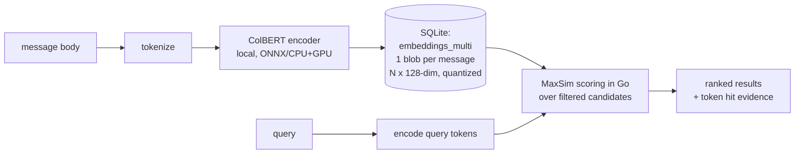

# ADR-0030: Late-interaction retrieval for semantic search

- **Status:** Proposed
- **Date:** 2026-08-26
- **Related:** [ADR-0002](0002-vector-backend.md) (vector backend), [ADR-0013](0013-pure-go-sqlite-driver.md) (pure-Go driver), [SPEC-0002](../openspec/specs/search/spec.md) (Search)

## Context and Problem Statement

Semantic search today stores **one pooled float32 vector per message**
(`embeddings` table, schema v3) and ranks by brute-force cosine in Go. That is a
"no-interaction" retriever: everything the model knows about a message is
compressed into a single vector before it is ever compared to a query. On short,
jargon-heavy texts — exactly what message archives are — pooling loses token-level
nuance (names, code-ish fragments, slang), and there is no way to explain *why*
something matched.

Late-interaction models (ColBERT and descendants) keep **one vector per token**
per document and score at query time with MaxSim (for each query token, take its
best-matching document token, then sum). They match bi-encoder speed with
cross-encoder-like precision and give token-level explainability for free.
Should msgbrowse switch?

## Decision Drivers

* Retrieval quality on short texts is the whole point of the Overview/Journal;
  better recall of "that one phrase" queries is the top user-visible win.
* Local-first ethos ([ADR-0004](0004-mcp-sdk-and-rag.md)): the embedding path
  must run against Joe's own hardware; no new always-on service.
* One SQLite file stays non-negotiable ([ADR-0002](0002-vector-backend.md),
  [ADR-0013](0013-pure-go-sqlite-driver.md)).
* The existing LLM/embedding gateway is OpenAI-compatible and returns **one
  vector per input** — it cannot produce token-level multi-vectors.

## Considered Options

1. **Re-run embeddings** through the current endpoint — not possible: pooled
   single-vector APIs cannot emit multi-vectors; re-running changes nothing.
2. **Self-hosted ColBERT-style encoder + multi-vector storage + MaxSim in Go**
   — schema change, new local model dependency, full re-index.
3. **Add a cross-encoder reranker over existing single-vector results** — keeps
   the pipeline, adds precision at query time only.
4. **Stay put.**

## Decision Outcome

Chosen option: **(2) a self-hosted late-interaction encoder**, because it is the
only option that improves recall (not just reranking) and yields token-level
explainability, while staying within the local-first, one-file constraints at
personal-archive scale. Storage is the classic objection but quantized
multi-vectors cost ~2–10× today's footprint (~1 KB vs ~150 B–6 KB per message),
which SQLite absorbs without complaint at hundreds of thousands of messages.
Cross-encoder reranking (option 3) is explicitly deferred as the fallback if the
indexing cost proves annoying — it is a strictly smaller change and composes
with either backend.

### Consequences

* Good, because MaxSim ranking materially beats pooled-cosine on short,
  entity-dense messages (the archive's dominant shape).
* Good, because matches become explainable: which query token hit which message
  token can be surfaced in the UI/MCP later.
* Bad, because embeddings must come from a locally-run model (ColBERTv2 ≈ 110M
  params: ~250 MB fp16 VRAM or CPU-only at query time); the hosted embedding
  endpoint is no longer on the semantic-search path.
* Bad, because it is a full-corpus re-embed plus a schema migration, coordinated
  via `model` keying (the coexistence rule from schema v3 already anticipates
  this).
* Neutral: ColPali/ColQwen (image patches over PDFs/screenshots) is out of scope
  until attachments are indexed; the storage layout chosen here does not block it.

## Architecture Diagram

## More Information

- ColBERT paper: https://arxiv.org/abs/2004.12832 · ColBERTv2: https://arxiv.org/abs/2112.01488
- Weaviate overview that prompted this: https://weaviate.io/blog/late-interaction-overview
- Formalized in [SPEC-0019](../openspec/specs/late-interaction-search/spec.md).
