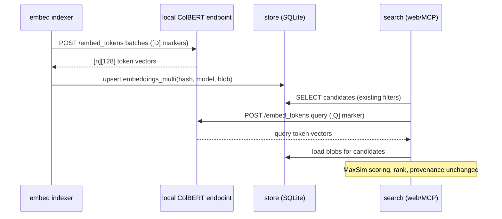

# Design: Late-interaction semantic search

## Context

Today `internal/store/vector.go` stores one float32 blob per `(message_hash,
model)` and ranks by brute-force cosine (`SemanticSearch`); `internal/embed`
drives incremental embedding runs against the OpenAI-compatible gateway. See
SPEC-0019 for requirements and [ADR-0030](../../../adr/0030-late-interaction-retrieval.md)
for the decision rationale and rejected alternatives (rerank-only, no-op).

## Goals / Non-Goals

### Goals

- Token-level retrieval quality on short messages, with explainable matches.
- Local-only embedding path; one SQLite file; model-switchable indexes.
- Incremental backfill with resumable progress, reusing embed-run plumbing.

### Non-Goals

- ColPali/ColQwen multimodal (attachment/PDF) indexing — later ADR if wanted.
- ANN indexing (HNSW etc.) — brute-force scan is fine at archive scale.
- Changing the web UI result contract or MCP hybrid fusion shape.

## Decisions

### Storage: quantized blob list per message

**Choice**: new table `embeddings_multi(message_hash, model, vec BLOB, n INT)`
mirroring the v3 coexistence rule. Blob layout: header (version byte, dim byte,
quant mode byte) followed by N packed token vectors.

**Rationale**: keeps one file, one lookup per message at query time. 128-dim
tokens at int8 (1 B/dim) → ~130 B/token, or ~4 KB for a 30-token message vs
~6 KB today — under 10× of the *current* footprint even in the worst case, and
the doc-tokenization step can drop padding tokens like ColBERT does.

**Alternatives considered**:
- One row per token vector — thousands of rows per conversation; SQLite row
  overhead dominates and queries become join-heavy. Rejected.
- Two-bit residual compression à la ColBERTv2 — needs centroid files alongside
  the DB, breaking the "one file" property at this scale. Revisit if storage hurts.

### Encoder: locally hosted ColBERT-style model

**Choice**: run a ColBERTv2-class encoder (~110M params) as an ONNX/PyTorch
endpoint on Joe's GPU box via the LiteLLM/gateway pattern, exposing a batch
`POST /embed_tokens` returning `[n_tokens][128]` arrays; msgbrowse stores them
after int8 quantization + per-vector norm bookkeeping.

**Rationale**: the existing hosted endpoint physically cannot emit
multi-vectors. CPU-only inference works for query-time single queries (<100 ms)
and tolerable for background indexing (~30 msgs/s), so the GPU requirement is
about backfill comfort, not correctness.

**Alternatives considered**:
- Embed in-process with cgo/onnxruntime — adds a heavy native dep to every build
  target including distroless containers; network call to a local service fits
  msgbrowse's existing LLM-client architecture better. Rejected.

### Scoring: MaxSim over filtered candidates in Go

**Choice**: candidate set selected by the same SQL filters as today, blobs
loaded, unquantized on the fly (int8→float32 scale factor stored in header),
MaxSim computed as dot products in tight loops. Cosine normalization happens at
encode time so dot ≈ cosine.

**Rationale**: pure Go, no extension dependency (ADR-0013 closed the C-extension
door), same performance envelope as the existing brute-force scan because the
dominant cost is the filtered message set, not the arithmetic. Empty query
returns nothing, exactly like SPEC-0002 REQ-004.

### Migration: parallel index, config-flipped backend

**Choice**: new `semantic_backend` concept extends the existing model-keyed
embeddings: both systems coexist by design; a config value selects which one
serves `/search`, hybrid fusion, and MCP until coverage hits 100%, after which
the legacy path can be retired in a follow-up.

**Rationale**: schema v3's coexistence rule already anticipated dual-model data;
cutover becomes a config change with instant revert, not a big-bang rewrite.

## Architecture

## Risks / Trade-offs

- **Storage growth on long messages** (int8 costs ~130 B/token, so anything over
  ~47 tokens exceeds today's flat 6 KiB pooled vector) → cap tokens per message
  at 256, bounding a blob at ~32 KiB; verify-mode reports bytes; revisit
  compression only if it actually hurts. Short messages — most of the archive —
  cost less than the index they replace.
- **Local model operational burden** (download, updates) → pinned model version
  in config; endpoint health surfaced on Status; embed runs fail loudly rather
  than silently skipping.
- **Two search code paths during migration** → shared filter/candidate SQL;
  backend switch isolated to the scoring entrypoint; delete legacy path in the
  retirement follow-up, never leave both live past the migration window.

## Migration Plan

1. Schema migration adds `embeddings_multi` (additive; old table untouched).
2. Ship encoder client + `embed --model colbertv2 --multi`; backfill runs offline.
3. Flip `search.semantic_backend = late-interaction` once coverage complete;
   verify-mode confirms row drift before flip.
4. Follow-up retires the single-vector semantic path (separate PR, after a bake
   period).

Rollback: point config back at the legacy backend; no data deletion at any step.

## Open Questions

- Exact model pick (colbertv2 checkpoint vs newer lightweight variants) — decide
  at implementation time with a quality smoke test against the real archive.
- Does MCP hybrid fusion want token-hit evidence exposed as provenance now, or
  deferred to the UI explainability pass?
