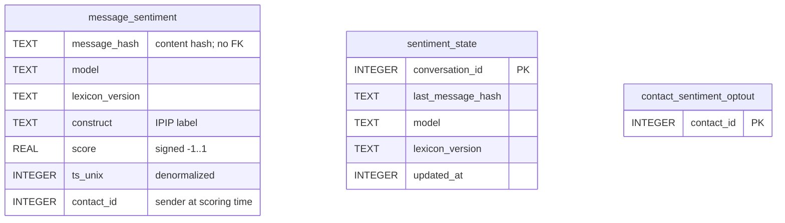
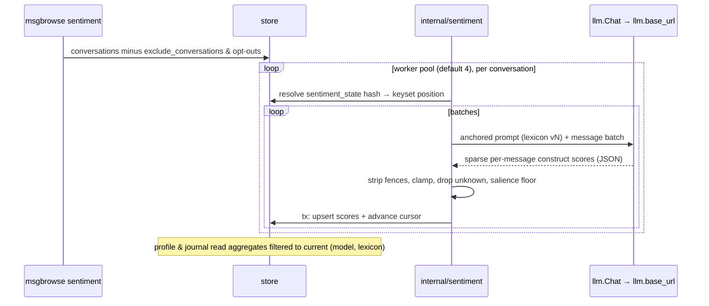

# Design: IPIP-anchored sentiment & trait scoring

## Context

[ADR-0028](../../../adr/0028-ipip-sentiment-trait-scoring.md) decided the
taxonomy: a curated two-tier subset of the public-domain IPIP construct pool
(five Big Five domains + ~10 affect facets), scored by the configured chat
model with IPIP marker items as prompt anchors, stored in the hash-keyed,
model-stamped table that [SPEC-0017 REQ-0017-010](../contact-profile/spec.md)
reserved. This design covers how the lexicon is built, how scoring runs, and
how the three consumer surfaces read the table. The implementation template is
`internal/facts` ([ADR-0011](../../../adr/0011-contact-facts-extraction.md)):
same cursor, same egress posture, same defensive parsing stance.

## Goals / Non-Goals

### Goals
- One sparse table that any future affect/trait surface can aggregate at read
  time without new scoring runs.
- Scoring stable enough to survive prompt edits and model swaps re-derivably
  (`model` + `lexicon_version` stamps; rescan on change).
- Privacy at least as strong as facts: exclusion before read, retroactive
  per-contact opt-out, single egress, deliberate command.

### Non-Goals
- Psychometric validity. IPIP validation applies to self-report inventories;
  we borrow its constructs and anchors for LLM judgment consistency, and every
  surface says so.
- Web-triggered scoring, MCP exposure, non-English anchors, score curation UI
  (all deferred; see spec Scope).

## Decisions

### Lexicon: a small committed Go table over an embedded CSV

**Choice**: `internal/sentiment` embeds the normalized IPIP item table
(`ipip_items.csv`, columns `instrument,alpha,key,text,label`, attribution
header) and defines the lexicon in Go: an ordered list of constructs, each
with its tier (`domain`/`affect`), the table label(s) it draws anchors from,
and the anchor-selection rule. `lexiconVersion` is a package constant
(`"v1"`).

**Rationale**: the full table is data (3,805 rows, public domain — embed it
verbatim, attributable and diffable); the curation is code (15 entries — a Go
literal is type-checked, testable, and needs no config-file parsing). Bumping
curation is a code change that must bump `lexiconVersion`, which a test
enforces by hashing the lexicon definition.

**Anchor selection**: per construct, take marker items from assignments with
alpha ≥ 0.75, dedupe identical item texts across instruments, prefer the
highest-alpha assignment for keying, and keep up to 6 anchors — at least one
positively and one negatively keyed (REQ-0027-001 fails the build otherwise).
Domain constructs may draw from sibling labels (e.g. Intellect/Openness draws
from `Intellect` and `Intellectual Openness`); affect constructs map 1:1 to
their table label.

**Alternatives considered**:
- YAML lexicon file: parseable at runtime, but adds a parser + validation for
  15 static entries; rejected.
- Runtime queries over the full table: pointless generality — the lexicon is
  the API; the table is an implementation detail of building it.

### Score semantics: signed, sparse, salience-gated

**Choice**: the model returns, per message, only constructs with salient
evidence, scored in [−1, +1]; the engine clamps out-of-range values, drops
unknown constructs, and discards |score| < 0.2 before storage.

**Rationale**: sign carries direction on bipolar domain axes (reserved ↔
gregarious); affect facets live mostly in the positive range. The salience
floor keeps "ok, see you at 6" from producing rows — the table stays
proportional to expressive content, not corpus size.

### Batching and attribution

**Choice**: conversations are scored in keyset-ordered batches (mirroring
facts' batch walk); each message is scored independently but with the batch as
conversational context; `contact_id` is denormalized at scoring time as the
message *sender's* resolved contact (including the owner), and `ts_unix` is
copied from the message.

**Rationale**: sender attribution is what both consumer surfaces need (the
profile shows the *contact's* expressed affect; the journal aggregates
everyone's). Denormalizing avoids joining through `messages` at read time,
which also keeps aggregates working for scores whose message row is
mid-re-ingest. Batch-as-context lets the model read sarcasm and quoted text
without scoring the batch as a unit.

### Read-side filtering to the current (model, lexicon)

**Choice**: aggregates read only rows matching the currently configured model
and shipped `lexiconVersion`. Stale rows from prior models/lexicons are
retained until `--reset`.

**Rationale**: mixing scores from different models in one average is
meaningless. Retention keeps a model rollback cheap (the old rows are still
there); `--reset` is the explicit "reclaim disk" lever, same trade facts
accepted.

### Opt-out lives on the contact profile, deletes in-transaction

**Choice**: a `contact_sentiment_optout(contact_id)` table; the profile page
hosts the gated toggle (`checkSetupPOST`, fixed-enum banner, boosted partial
re-render); opting out deletes the contact's rows and inserts the marker in
one transaction; the scoring engine skips opted-out senders' messages before
content is read.

**Rationale**: the profile is where the user is looking at a person and
decides "not this one" — a Settings list of every contact would be heavier and
farther from the moment of decision. Deletion (not suppression) is the honest
reading of opt-out for a dossier-shaped feature; re-opting-in rebuilds on the
next run because cursors are per-conversation, so the engine detects the gap
via missing rows only on `--reset` — acceptable: opting back in is documented
as "takes effect for future runs; use `--reset` to rebuild history."

**Alternative considered**: a column on `contacts` — rejected; merge/split
(`SPEC-0018`) moves identities between contact rows, and a separate marker
table keyed by canonical contact id keeps the merge engine untouched.

### Consumer surfaces are aggregates + templates, no new pages

**Choice**:
- Profile sentiment-over-time: month-bucketed mean intensity per affect facet
  (`strftime('%Y-%m', ts_unix, 'unixepoch')`), rendered with the existing
  sparkline pattern (presentational-attribute SVG + `aria-label` text
  alternative).
- Profile trait sketch: mean signed score per domain, all-time, rendered only
  at ≥ 50 scored messages (REQ-0027-008), as labeled text+bar rows — no
  radar chart (color-alone/legend problems, and five rows read fine).
- Journal mood strip: per-UTC-day mean intensity per affect facet on the day
  view, additive to the existing rollup card.

**Rationale**: every surface is one SQL aggregate over `message_sentiment`
plus template work inside existing swap units — `contact_content` and the
journal day view keep their SPEC-0008/0017 partial contracts, and the
contact-scope predicate is untouched, which is exactly the seam REQ-0017-010
promised.

## Architecture

## Risks / Trade-offs

- **Dossier sensitivity** — trait profiles of real people. → Local-only, no
  MCP exposure, retroactive opt-out that deletes, AI-generated +
  "expressed-not-assessed" labeling on every surface; the opt-out is in the
  first migration, not a follow-up.
- **First-run cost on a big archive** — the widest-egress extraction yet. →
  Incremental cursors, sparse salience-gated output, batch-level resume;
  document that the first run is long and interruptible.
- **Model quality variance** — a weak local model scores noisily. → Anchored
  prompts narrow the variance; the `model` stamp keeps distributions from
  mixing; thresholds (salience floor, 50-message sketch minimum) suppress
  thin evidence rather than rendering it.
- **English-only anchors** — non-English threads score worse, silently. →
  Documented limitation in the UI disclaimer text; translated lexicons are an
  explicit non-goal until wanted.
- **Table growth** (rows ≈ expressive messages × salient constructs, per
  model/lexicon generation). → Sparse storage bounds the common case;
  `--reset` reclaims stale generations.

## Migration Plan

One schema migration (next version after current `schemaVersion`) adding the
three tables above; FK-less by design, so it composes with re-ingest exactly
like v4 (facts). Greenfield feature otherwise — no data backfill; the table
populates on the first `msgbrowse sentiment` run. Rollback is dropping the
tables; no other subsystem writes or reads them.

## Open Questions

- Should the owner's own messages feed a "you" mood surface (the journal
  already aggregates them implicitly)? Deferred until the journal surface has
  real usage.
- Does `sync` (SPEC-0007) eventually chain `sentiment` after `facts` as an
  opt-in step? Deliberate-command posture says not by default; revisit once
  first-run cost is measured.
- Whether the affect tier wants per-facet toggles (score Anxiety but not
  Depression) — punted; the lexicon is all-or-nothing in v1.

## Testing

- `internal/sentiment`: lexicon build (anchor coverage per construct, loud
  failure on label drift, version-hash guard), prompt assembly (anchors +
  keying present), response parsing (fence stripping, clamping, unknown-
  construct drop, salience floor, malformed-entry skip).
- `internal/store`: migration lineage (existing pattern in
  `lineage_test.go`), upsert idempotency, cursor resolve/restart semantics,
  model/lexicon-change rescan trigger, opt-out delete+marker transaction,
  month/day aggregate bucketing (UTC day rule against straddling-midnight
  fixtures, per ADR-0023).
- `internal/cli`: `sentiment` command wiring, `--reset`, non-zero exit on
  aborted run (mirroring `facts.go` tests).
- `internal/web`: profile surfaces (empty states, 50-message threshold,
  disclaimer presence, SVG presentational-attributes + `aria-label`,
  boosted-partial contract unchanged), journal mood strip (absent without
  scores, day-bucket alignment), opt-out POST gating (403 without token,
  fixed-enum banner) — race detector on, as the suite already runs.
